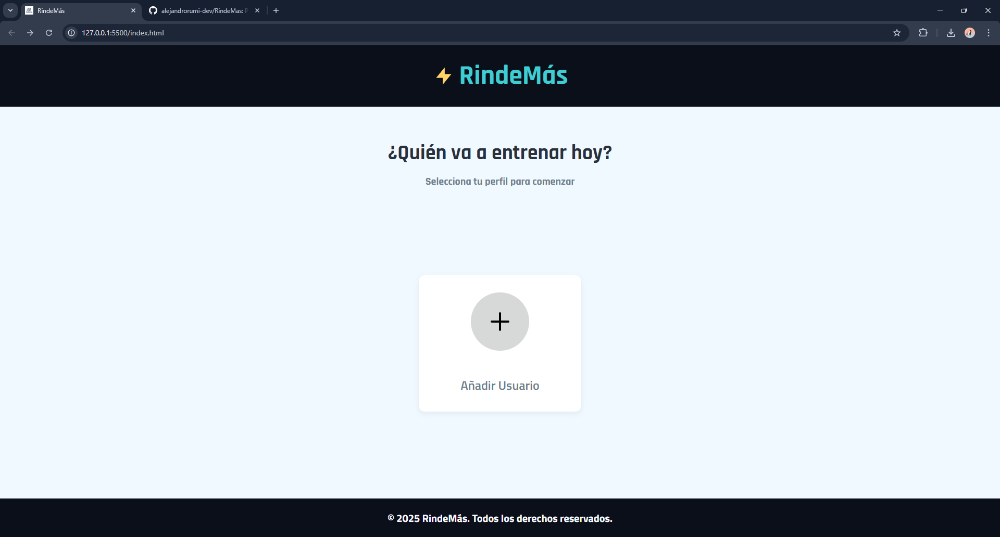
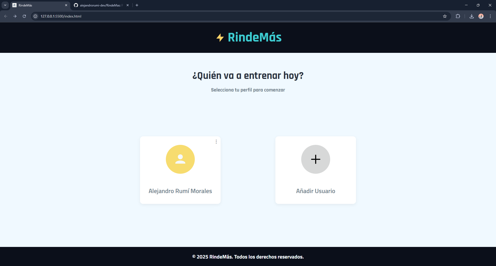
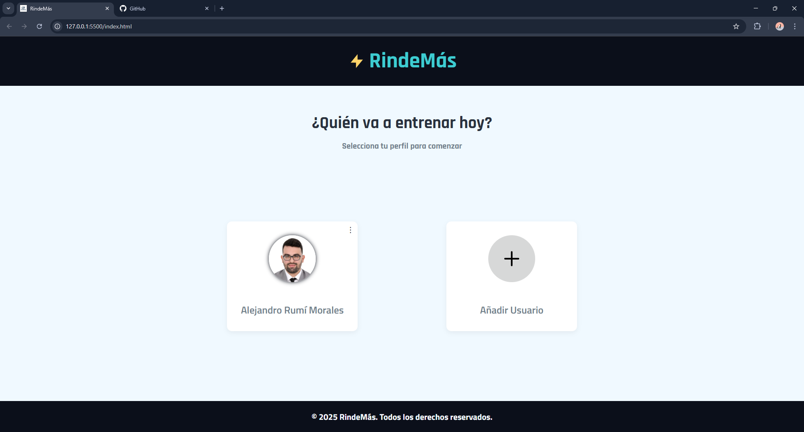
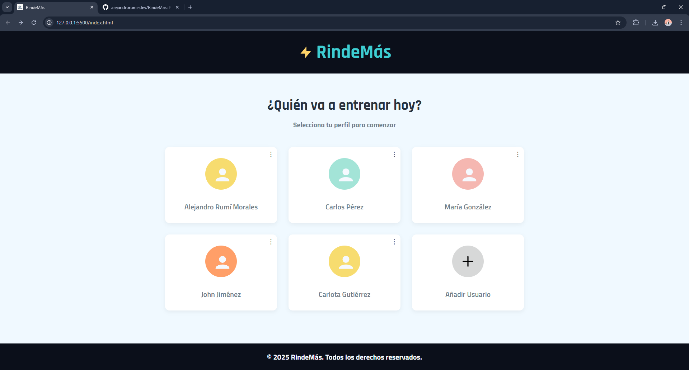
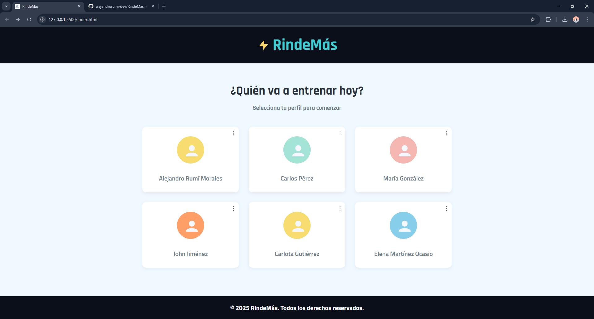
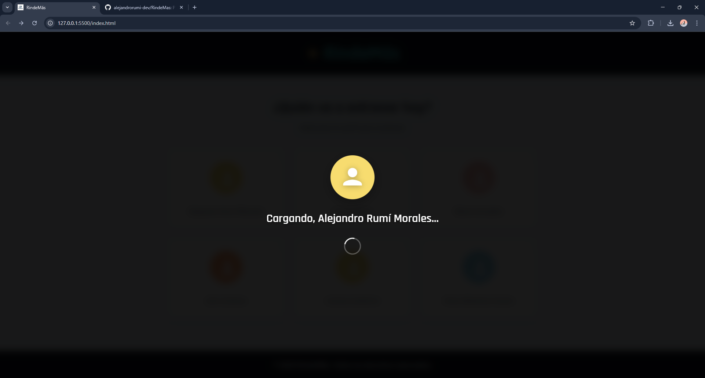
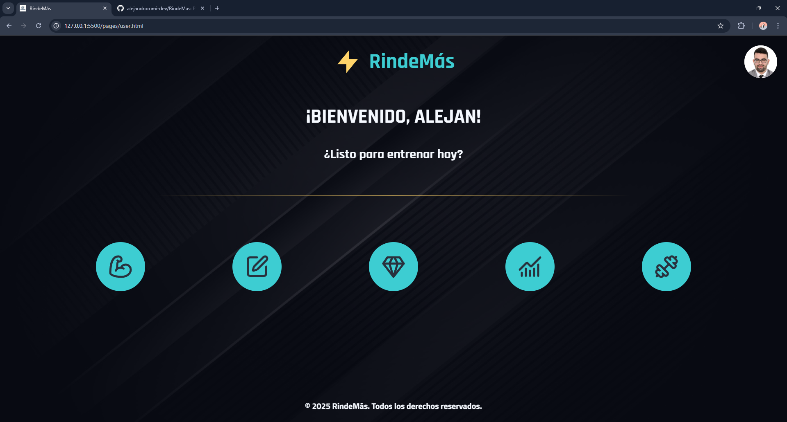
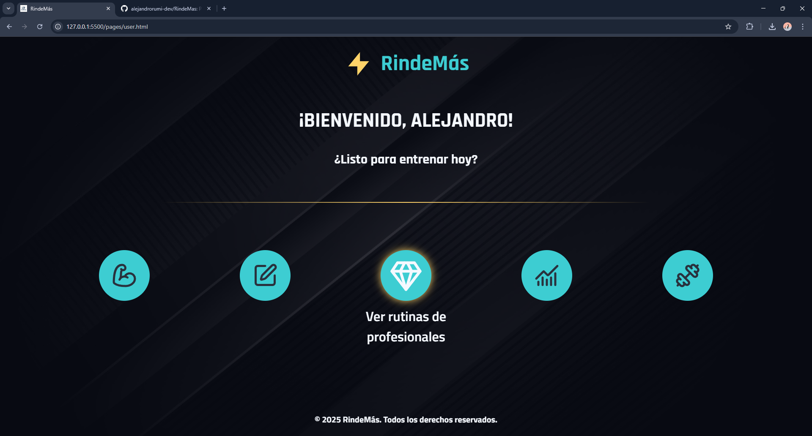

# 🏋️‍♂️ RindeMás

**RindeMás** es una aplicación web personal para gestionar rutinas de entrenamiento y usuarios asociados. Pensada como herramienta de uso diario para ti y tu entorno (familiares, amigos), permite añadir perfiles personalizados y organizar sesiones de ejercicio según el día o grupo muscular.

## 🚀 Estado del proyecto

### 1. **Página de inicio ✅**

- ✅ Estructura HTML finalizada
- ✅ Estilos CSS aplicados (colores, tipografía, grid, botones, etc.)
- ✅ Formulario de creación de usuarios finalizado
- ✅ Edición de usuario con validación visual
- ✅ Prevención de usuarios duplicados
- ✅ Almacenamiento local con `localStorage`
- ✅ Selección múltiple y eliminación masiva
- ✅ Eliminación con cuenta regresiva
- ✅ Transiciones y alertas visuales estilizadas
+ 🛠️ En desarrollo: Responsive design

---

### 2. **Página de usuario (En desarrollo 🛠️)**

- ✅ Estructura HTML inicial
- ✅ Imagen de fondo
- ✅ Estilos base en CSS
+ 🛠️ En desarrollo: Vincular con página de routine.html
+ 🛠️ En desarrollo: Responsive design

---

## ✨ Funcionalidades

- Interfaz visual con selección de perfiles
- Creación de usuario con formulario validado
- Edición de perfiles existentes
- Prevención de duplicados (nombre y apellido)
- Alerta visual para eliminar (individual o masivo)
- Cuenta regresiva antes de eliminar usuarios
- Visualización de hasta 6 usuarios
- Persistencia de datos con `localStorage`
- Animaciones suaves y mensajes informativos
- Estructura modular de JS y CSS

---

## 🖼️ Capturas de pantalla

### Página de Inicio

#### Captura de pantalla de Inicio


#### Captura de pantalla de Inicio con un usuario creado


#### Captura de pantalla de Inicio con foto de perfil en un usuario


#### Captura de pantalla de Inicio con cinco usuarios creados


#### Captura de pantalla de Inicio con seis usuarios creados, el máximo permitido


---

### Página de Usuario

#### Captura de pantalla de Inicio a la página del Usuario


#### Captura de pantalla de Usuario


#### Captura de pantalla del funcionamiento de los botones de Usuario


---

## 📂 Estructura del proyecto

```plaintext
RindeMas/
├── assets/
│   ├── captures/
│   ├── images/
│   ├── logo/
│   └── wireframe/
├── css/
│   ├── base/
│   ├── components/
│   ├── pages/
│   ├── style.css
│   └── user-main.css
├── data/
│   └── exercises.json
├── js/
│   ├── pages/
│   └── shared/
├── pages/
│   └── user.html
├── index.html
├── README.md

```

---

## 🧩 Tecnologías utilizadas

- HTML5
- CSS3
- JavaScript (implementado en la página de inicio)
- localStorage para persistencia de usuarios
- Google Fonts (Titillium Web, Rajdhani)
- Metodología BEM (Bloques, Elementos, Modificadores)

---

## 🛠️ Cómo ejecutar el proyecto

Puedes abrir el proyecto localmente así:

1. Clona el repositorio:
   ```bash
   git clone https://github.com/tu-usuario/rindemas.git
   ```
2. Abre `index.html` en tu navegador.

> También puedes desplegarlo fácilmente en GitHub Pages o Netlify.

---

## 🤝 Cómo contribuir

1. Haz un fork del repositorio.
2. Crea una rama nueva con tu mejora:
   ```bash
   git checkout -b mejora/tu-funcionalidad
   ```
3. Realiza tus cambios y haz commit:
   ```bash
   git commit -m "Agrega nueva funcionalidad"
   ```
4. Haz push a la rama:
   ```bash
   git push origin mejora/tu-funcionalidad
   ```
5. Abre un Pull Request en GitHub.

---

## 🌐 Demo en vivo

Puedes ver la página de inicio funcionando aquí:
[https://alejandrorumi-dev.github.io/RindeMas/](https://alejandrorumi-dev.github.io/RindeMas/)

## 👨‍💻 Autor

Desarrollado por **Alejandro Rumí Morales** como proyecto personal de aprendizaje y mejora en desarrollo frontend.  
Forma parte de su portafolio técnico y de prácticas con HTML, CSS y JavaScript.